# CYPD Module

## I. Quick Start

* 利用 npx 安裝開發環境

```
yarn create-react-app my-app --template typescript
yarn add typescript @types/node @types/react @types/react-dom @types/jest
npm install --save https://github.com/ChoFrank/cypd.git
# my-app可自由替換成專案名稱

也可以使用
npm install --save ChoFrank/cypd

如要安裝其他分之支
npm install --save ChoFrank/cypd#ct_style
```

* 利用 npm/yarn 測試/編譯您的 javascript project

```
npm run start 
# run your project through the entry point (usually index.js/index.tsx/index.jsx)
npm run build 
# compile your project to ES5 javascript code
```

## II. Upgrade Library

```
npm update cypd
```

Update to speific version
```
npm install --save https://github.com/ChoFrank/cypd.git#${commit}
# commit fillin version number
```

## III. Basic Component Example

* [Button 按鍵](https://github.com/ChoFrank/cypd/tree/master/src/button)
* [Icon 圖標](#2)
* [Input 輸入框](#3)
* [Select & Option 選擇框與選項](#4)
* [Checkbox 勾選框](#5)
* [SwitchButton 切換鈕](#6)
* [RadioGroup 單選選項群](#7)
* [Slider 拉霸](#8)

### 1. <a name="1"></a>Button 按鍵

Properties      | Type                                              | Default value     | Description
----------------|:--------------------------------------------------|:------------------|:----------------------
type            | "default" \| "primary" \| "danger"                | "default"         | Determine button style.
icon            | `string`                                          | `undefined`       | Determine button prefix icon.
size            | "normal" \| "small"                               | "normal"          | Determine button's size (Only 2 options. if you want somthing else, please check `className` or `style` properties).
shape           | "round" \| `undefined`                            | `undefined`       | Determine button's shape.
disabled        | `boolean` \| `undefined`                          | `undefined`       | Determine button is disabled or not.
className       | `string` \| `undefined`                           | `undefined`       | Programmer can use this property to defined specific CSS style.
style           | `React.CSSProperties` \| `undefined`              | `undefined`       | Programmer can use this property to defined inline CSS style.
onClick         | `(e: React.MouseEvent) => void` \| `undefined`    | `undefined`       | The handle function of clicking action

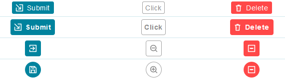

```javascript
// CYPD Button sample code
import React from 'react';
import ReactDOM from 'react-dom';
import { Button } from 'cypd';

class App extends React.Component {
    render() {
        return ( 
            <div>
                <Button type="primary">Submit</Button>
                <Button type="default">Edit</Button>
                <Button type="danger">Delete</Button>
            </div> 
        );
    }
}
ReactDOM.render(<App />, document.getElementById('root'));
```

### 2. <a name="2"></a>Icon 圖標

> properties (*) are compulsory

Properties      | Type                                              | Default value     | Description
----------------|:--------------------------------------------------|:------------------|:----------------------
type(*)         | `string`                                          |                   | Determine which icon.
color           | `string`                                          | `undefined`       | Determine stroke or fill color.
className       | `string` \| `undefined`                           | `undefined`       | Programmer can use this property to defined specific CSS style.
style           | `React.CSSProperties` \| `undefined`              | `undefined`       | Programmer can use this property to defined inline CSS style.
onClick         | `(e: React.MouseEvent) => void` \| `undefined`    | `undefined`       | The handle function of clicking action

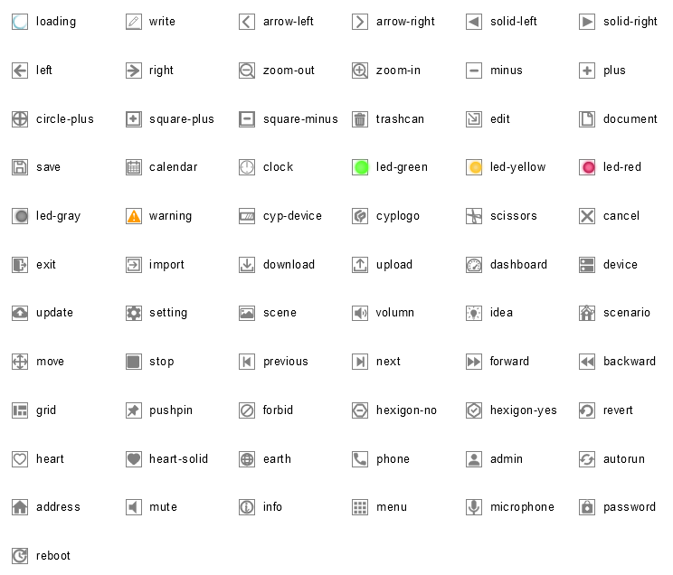

```javascript
// CYPD Icon sample code
import React from 'react';
import ReactDOM from 'react-dom';
import { Icon } from 'cypd';

class App extends React.Component {
    render() {
        return ( 
            <div>
                <Icon type="save"></Icon>
                <Icon type="write"></Icon>
                <Icon type="download"></Icon>
            </div> 
        );
    }
}
ReactDOM.render(<App />, document.getElementById('root'));
```

### 3. <a name="3"></a>Input 輸入框

Properties      | Type                                              | Default value     | Description
----------------|:--------------------------------------------------|:------------------|:----------------------
value           | `string` \| `number`                              | `undefined`       | Determine Input value.
size            | "normal" \| "small"                               | "normal"          | Determine Input's size (Only 2 options. if you want somthing else, please check `className` or `style` properties).
placeholder     | `string`                                          | `undefined`       | Content showed when value is empty.
disabled        | `boolean` \| `undefined`                          | `undefined`       | Determine Input is disabled or not.
defaultValue    | `string` \| `number`                              | `undefined`       | You should use either `value` property or this (choose one).
readOnly        | `boolean` \| `undefined`                          | `undefined`       | Make input read-only when this property is true.
className       | `string` \| `undefined`                           | `undefined`       | Programmer can use this property to defined specific CSS style.
style           | `React.CSSProperties` \| `undefined`              | `undefined`       | Programmer can use this property to defined inline CSS style.
onChange        | `(e: React.ChangeEvent<HTMLInputElement>) => void` \| `undefined`    | `undefined`       | This function is triggered when typing.
onBlur          | `(e: React.FocusEvent<HTMLInputElement>) => void` \| `undefined`    | `undefined`       | This function is triggered when unfocusing.
onKeyPress      | `(e: React.KeyboardEvent<HTMLInputElement>) => void` \| `undefined`    | `undefined`       | This function is triggered when pressing keyboard.
onMouseDown     | `(e: React.MouseEvent<HTMLInputElement>) => void` \| `undefined`    | `undefined`       | This function is triggered when mouse clicking.

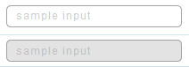

```javascript
// CYPD Input sample code
import React from 'react';
import ReactDOM from 'react-dom';
import { Input } from 'cypd';

class App extends React.Component {
    constructor(props) {
        super(props);
        this.state = { value1: '', value2: '' };
    }
    handler1 = (e) => {
        this.setState({ value1: e.target.value });
    } 
    render() {
        return ( 
            <div>
                <Input value={this.state.value1} onChange={this.handler1}></Input>
                <Input value={this.state.value2} disabled></Input>
            </div> 
        );
    }
}
ReactDOM.render(<App />, document.getElementById('root'));
```

### 4. <a name="4"></a>Select & Option 選擇框與選項

#### Select

Properties      | Type                                              | Default value     | Description
----------------|:--------------------------------------------------|:------------------|:----------------------
value           | `string` \| `number`                              | `undefined`       | Determine Select value.
size            | "normal" \| "small"                               | "normal"          | Determine Select's size (Only 2 options. if you want somthing else, please check `className` or `style` properties).
placeholder     | `string`                                          | `undefined`       | Content showed when value is empty.
disabled        | `boolean` \| `undefined`                          | `undefined`       | Determine Select is disabled or not.
collapsed       | `boolean` \| `undefined`                          | `undefined`       | Control the options' view collapsed or not
className       | `string` \| `undefined`                           | `undefined`       | Programmer can use this property to defined specific CSS style.
style           | `React.CSSProperties` \| `undefined`              | `undefined`       | Programmer can use this property to defined inline CSS style.
onChange        | `(value: string) => void` \| `undefined`          | `undefined`       | This function is triggered after selecting.

#### Option

Properties      | Type                                              | Default value     | Description
----------------|:--------------------------------------------------|:------------------|:----------------------
value           | `string` \| `number`                              | `undefined`       | Determine Option value.
disabled        | `boolean` \| `undefined`                          | `undefined`       | Determine Option is disabled or not.

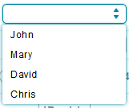

```javascript
// CYPD Select & Option sample code
import React from 'react';
import ReactDOM from 'react-dom';
import { Select, Option } from 'cypd';

class App extends React.Component {
    constructor(props) {
        super(props);
        this.state = { value: '' };
    }
    handler = (value) => {
        this.setState({ value: value });
    } 
    render() {
        return ( 
            <div>
                <Select value={this.state.value} onChange={this.handler}>
                    <Option value='1'>John</Option>
                    <Option value='2'>Mary</Option>
                    <Option value='3'>David</Option>
                    <Option value='4'>Chris</Option>
                </Select>
            </div> 
        );
    }
}
ReactDOM.render(<App />, document.getElementById('root'));
```

### 5. <a name="5"></a>Checkbox 勾選框

Properties      | Type                                              | Default value     | Description
----------------|:--------------------------------------------------|:------------------|:----------------------
label           | `string` \| `undefined`                           | `undefined`       | Determine Checkbox's label.
checked         | `boolean` \| `undefined`                          | `undefined`       | Determine Checkbox is checked or not.
disabled        | `boolean` \| `undefined`                          | `undefined`       | Determine Checkbox is disabled or not.
readOnly        | `boolean` \| `undefined`                          | `undefined`       | Make Checkbox read-only when this property is true.
className       | `string` \| `undefined`                           | `undefined`       | Programmer can use this property to defined specific CSS style.
style           | `React.CSSProperties` \| `undefined`              | `undefined`       | Programmer can use this property to defined inline CSS style.
onChange        | `(e: React.ChangeEvent<HTMLInputElement>) => void` \| `undefined`    | `undefined`       | This function is triggered after component is clicked.


```javascript
// CYPD Checkbox sample code
import React from 'react';
import ReactDOM from 'react-dom';
import { Checkbox } from 'cypd';

class App extends React.Component {
    render() {
        return ( 
            <div>
                <Checkbox readOnly label='Mornig' disabled checked></Checkbox>
                <Checkbox label='Afternoon'></Checkbox>
                <Checkbox readOnly checked label='Night'></Checkbox>
            </div> 
        );
    }
}
ReactDOM.render(<App />, document.getElementById('root'));
```

### <a name="6"></a>6. SwitchButton 切換鈕

Properties      | Type                                              | Default value     | Description
----------------|:--------------------------------------------------|:------------------|:----------------------
checked         | `boolean` \| `undefined`                          | `undefined`       | Determine SwitchButton is checked or not.
disabled        | `boolean` \| `undefined`                          | `undefined`       | Determine SwitchButton is disabled or not.
readOnly        | `boolean` \| `undefined`                          | `undefined`       | Make SwitchButton read-only when this property is true.
className       | `string` \| `undefined`                           | `undefined`       | Programmer can use this property to defined specific CSS style.
style           | `React.CSSProperties` \| `undefined`              | `undefined`       | Programmer can use this property to defined inline CSS style.
style           | `React.CSSProperties`                             | `undefined`       | Programmer can use this property to defined inline CSS style.
onChange        | `(e: React.ChangeEvent<HTMLInputElement>) => void` \| `undefined`    | `undefined`       | This function is triggered after component is clicked.

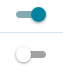

```javascript
// CYPD SwitchButton sample code
import React from 'react';
import ReactDOM from 'react-dom';
import { SwitchButton } from 'cypd';

class App extends React.Component {
    render() {
        return ( 
            <div>
                <SwitchButton />
            </div> 
        );
    }
}
ReactDOM.render(<App />, document.getElementById('root'));
```

### <a name="7"></a>7. RadioGroup 單選選項群

Properties      | Type                                              | Default value     | Description
----------------|:--------------------------------------------------|:------------------|:----------------------
options (*)     | `RadioOption` (below)                             |                   | Determine the radio amount and state
layout          | "vertical" \| "horizontal"                        | "horizontal"      | Determine RadioGroup orientation
value           | `string` \| `undefined`                           | `undefined`       | Determine current value of RadioGroup
className       | `string` \| `undefined`                           | `undefined`       | Programmer can use this property to defined specific CSS style.
style           | `React.CSSProperties` \| `undefined`              | `undefined`       | Programmer can use this property to defined inline CSS style.
onChange        | `(value: string) => void` \| `undefined`          | `undefined`       | This function is triggered after clicking.

#### RadioOption

Properties      | Type                                              | Default value     | Description
----------------|:--------------------------------------------------|:------------------|:----------------------
value (*)       | `string`                                          |                   | Define radio value
label           | `string` \| `undefined`                           | `undefined`       | Determine label of radio
disabled        | `boolean` \| `undefined`                          | `undefined`       | Determine option is disabled or not.

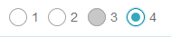

```javascript
// CYPD RadioGroup sample code
import React from 'react';
import ReactDOM from 'react-dom';
import { RadioGroup } from 'cypd';

class App extends React.Component {
    render() {
        return ( 
            <div>
                <RadioGroup 
                    options={[
                        { value: '1', label: '1' }, 
                        { value: '2', label: '2' }, 
                        { value: '3', label: '3', disabled: true }, 
                        { value: '4', label: '4' }
                    ]} 
                />
            </div> 
        );
    }
}
ReactDOM.render(<App />, document.getElementById('root'));
```

### <a name="8"></a>8. Slider 拉霸

Properties      | Type                                              | Default value     | Description
----------------|:--------------------------------------------------|:------------------|:----------------------
value           | `number` \| `undefined`                           | `undefined`       | Determine current value of Slider
disabled        | `boolean` \| `undefined`                          | `undefined`       | Determine Slider is disabled or not.
min             | `number` \| `undefined`                           | `undefined`       | Define the lower bound of Slider
max             | `number` \| `undefined`                           | `undefined`       | Define the upper bound of Slider
step            | `number` \| `undefined`                           | `undefined`       | Define value unit
className       | `string` \| `undefined`                           | `undefined`       | Programmer can use this property to defined specific CSS style.
style           | `React.CSSProperties` \| `undefined`              | `undefined`       | Programmer can use this property to defined inline CSS style.
onChange        | `(value: number) => void` \| `undefined`          | `undefined`       | This function is triggered ***when*** draging.
onAfterChange   | `(value: number) => void` \| `undefined`          | `undefined`       | This function is triggered ***after*** draging.

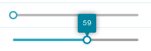

```javascript
// CYPD Slider sample code
import React from 'react';
import ReactDOM from 'react-dom';
import { Slider } from 'cypd';

class App extends React.Component {
    render() {
        return ( 
            <div>
                <Slider />
            </div> 
        );
    }
}
ReactDOM.render(<App />, document.getElementById('root'));
```

## IV. Advanced Component Example

* [Layout 布局](#9)
* [DatePicker & TimePicker 日期與時間選擇器](#10)
* [FormItem 表單元素](#11)
* [Modal 對話視窗](#12)
* [Notify 通知](#13)
* [Table 表格](#14)
* [Tooltip 提示框](#15)
* [Tree 樹狀展開結構](#16)
* [Spin 旋轉](#17)

### 9. <a name="9"></a>Layout 布局

#### Layout.Sider

Properties      | Type                                              | Default value     | Description
----------------|:--------------------------------------------------|:------------------|:----------------------
direction       | "left" \| "right"                                 | "left"            | Sider appears in left/right of center context
visible         | `boolean` | `undefined`                           | `undefined`       | Determine sider visible or not
onCollapse      | `(visible: boolean) => void` \| `undefined`       | `undefined`       | This function will be triggered after collapser is clicked. Notice that if `onCollapse` is undefined, the collapser button will not be shown.


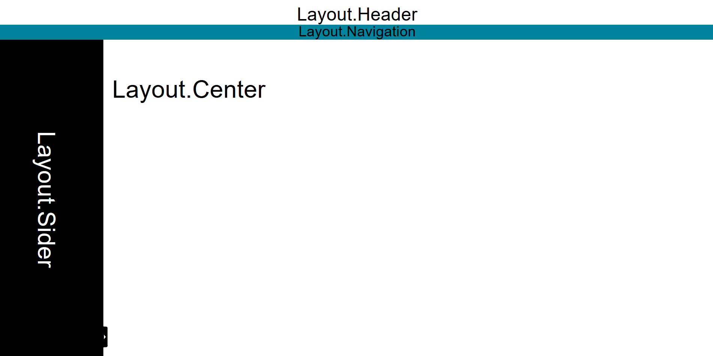

```javascript
// CYPD Layout sample code
import React from 'react';
import ReactDOM from 'react-dom';
import { Layout } from 'cypd';

class App extends React.Component {
    constructor(props) {
        super(props);
        this.state = { visible: true };
    }
    render() {
        return ( 
            <div style={{ height: 100%, width: 100% }}>
                <Layout.Header />
                <Layout.Navigation />
                <Layout.Body>
                    <Layout.Sider 
                        visible={this.state.visible}
                        onCollapse={(visible) => { this.setState({ visible }); }}
                    ></Layout.Sider>
                    <Layout.Center>
                        <div></div>
                    </Layout.Center>
                </Layout.Body>
            </div> 
        );
    }
}
ReactDOM.render(<App />, document.getElementById('root'));
```

### 10. <a name="10"></a>DatePicker & TimePicker 日期與時間選擇器

#### DatePicker

Properties      | Type                                              | Default value     | Description
----------------|:--------------------------------------------------|:------------------|:----------------------
value           | `Date`                                            | Depends on component created time | Determine date
format          | `string`                                          | "YYYY-MM-DD"      | Determine the format of date showed
disabled        | `boolean` \| `undefined`                          | `undefined`       | Determine picker is disabled or not.
className       | `string` \| `undefined`                           | `undefined`       | Programmer can use this property to defined specific CSS style.
style           | `React.CSSProperties` \| `undefined`              | `undefined`       | Programmer can use this property to defined inline CSS style.
onChange        | `(date: Date | Date[]) => void` \| `undefined`    | `undefined`       | This function will be triggered after date is changed

> The format string should follow these rules, the following words will be replaced with real value:
> * YYYY (year)
> * MM (month)
> * DD (day)
> * HH (hour)
> * mm (minute)
> * ss (second)
> * sss (millisecond)

#### TimePicker

Properties      | Type                                              | Default value     | Description
----------------|:--------------------------------------------------|:------------------|:----------------------
value           | `Date`                                            | Depends on component created time | Determine time
format          | `string`                                          | "YYYY-MM-DD"      | Determine the format of time showed
clockSystem     | "12-hour" \| "24-hour"                            | "24-hour"         | Determine time showed as 12-hour or 24-hour format
disabled        | `boolean` \| `undefined`                          | `undefined`       | Determine picker is disabled or not.
className       | `string` \| `undefined`                           | `undefined`       | Programmer can use this property to defined specific CSS style.
style           | `React.CSSProperties` \| `undefined`              | `undefined`       | Programmer can use this property to defined inline CSS style.
onChange        | `(date: Date | Date[]) => void` \| `undefined`    | `undefined`       | This function will be triggered after time is changed

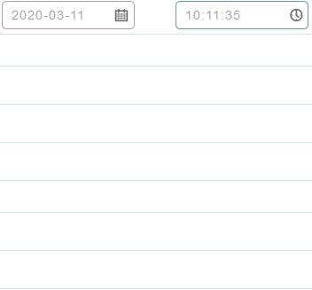

```javascript
// CYPD DateTime sample code
import React from 'react';
import ReactDOM from 'react-dom';
import { DateTime } from 'cypd';

class App extends React.Component {
    render() {
        return ( 
            <div>
                <DateTime.DatePicker></DateTime.DatePicker>
                <DateTime.TimePicker></DateTime.TimePicker>
            </div> 
        );
    }
}
ReactDOM.render(<App />, document.getElementById('root'));
```

### 11. <a name="11"></a>FormItem 表單元素

Properties      | Type                                              | Default value     | Description
----------------|:--------------------------------------------------|:------------------|:----------------------
label           | `ReactNode` \| `string` \| `undefined`            | `undefined`       | Determine the label is shown or not.
colon           | `boolean`                                         | `true`            | Determine the ":" character is shown or not.
layout          | "vertical" \| "horizontal"                        | "horizontal"      | Determine children components' orientation
error           | `string` \| `undefined`                           | `undefined`       | Present error message if `error` is not `undefined`.
disabled        | `boolean` \| `undefined`                          | `undefined`       | Determine picker is disabled or not.
className       | `string` \| `undefined`                           | `undefined`       | Programmer can use this property to defined specific CSS style.
style           | `React.CSSProperties` \| `undefined`              | `undefined`       | Programmer can use this property to defined inline CSS style.

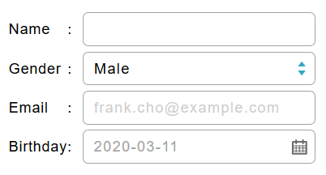

```javascript
// CYPD Form sample code
import React from 'react';
import ReactDOM from 'react-dom';
import { Form, Input, Select, Option, DateTime } from 'cypd';

class App extends React.Component {
    constructor(props) {
        super(props);
        this.state = {
            name: '',
            email: '',
            gender: '1',
            birthday: new Date()
        }
    }
    render() {
        return ( 
            <div style={{ width: '300px' }}>
                <Form.Item label={<span style={{display: 'inline-block', width: '55.5px'}}>Name</span>}>
                    <Input 
                        value={this.state.name} 
                        onChange={(e) => { this.setState({ name: e.target.name }); }}
                    ></Input>
                </Form.Item>
                <Form.Item label={<span style={{display: 'inline-block', width: '55.5px'}}>Gender</span>}>
                    <Select value={this.state.gender} onChange={(v) => { this.setState({ gender: v }); }}>
                        <Option value='1'>Male</Option>
                        <Option value='2'>Female</Option>
                    </Select>
                </Form.Item>
                <Form.Item label={<span style={{display: 'inline-block', width: '55.5px'}}>Email</span>}>
                    <Input
                        value={this.state.email}
                        placeholder="frank.cho@example.com"
                        onChange={(e) => { this.setState({ email: e.target.name }); }}
                    ></Input>
                </Form.Item>
                <Form.Item label='Birthday'>
                    <DateTime.DatePicker 
                        value={this.state.birthday} 
                        onChange={(date) => { this.setState({ birthday: date }); }} 
                    ></DateTime.DatePicker>
                </Form.Item>
            </div>
        );
    }
}
ReactDOM.render(<App />, document.getElementById('root'));
```

### 12. <a name="12"></a>Modal 對話視窗

Properties      | Type                                              | Default value     | Description
----------------|:--------------------------------------------------|:------------------|:----------------------
title           | `string` \| `undefined`                           | `undefined`       | Determine the title of modal. If `title` is `undefined`, pop-up modal will not have a title.
visible         | `boolean` \| `undefined`                          | `undefined`       | Determine modal is visible or not.
className       | `string` \| `undefined`                           | `undefined`       | Programmer can use this property to defined specific CSS style.
style           | `React.CSSProperties` \| `undefined`              | `undefined`       | Programmer can use this property to defined inline CSS style.
headerStyle     | `React.CSSProperties` \| `undefined`              | `undefined`       | Programmer can use this property to defined inline CSS style ***of modal's title***.
bodyStyle       | `React.CSSProperties` \| `undefined`              | `undefined`       | Programmer can use this property to defined inline CSS style ***of modal's inner body***.
onClose         | `(e: React.MouseEvent) => void` \| `undefined`    | `undefined`       | If `onClose` is not `undefined`, user can close modal by clicking "x" button or mask behind modal.

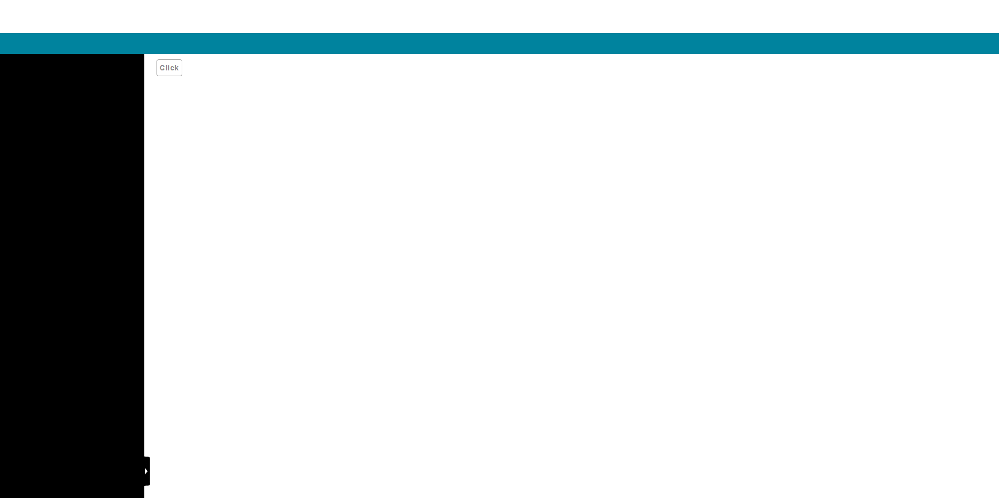

```javascript
// CYPD Modal sample code
import React from 'react';
import ReactDOM from 'react-dom';
import { Modal, Button } from 'cypd';

class App extends React.Component {
    constructor(props) {
        super(props);
        this.state = { popup: false };
    }
    open = () => { this.setState({ popup: true }); }
    close = () => { this.setState({ popup: false }); }
    render() {
        return ( 
            <div>
                <Button onClick={this.open}>Click</Button>
                <Modal
                    visible={this.state.popup}
                    onClose={this.close}
                    title='Demostration'
                >
                    This is a CYPD demostration
                </Modal>
            </div> 
        );
    }
}
ReactDOM.render(<App />, document.getElementById('root'));
```

### 13. <a name="13"></a>Notify 通知

Properties      | Type                                              | Default value     | Description
----------------|:--------------------------------------------------|:------------------|:----------------------
title (*)       | `string`                                          |                   | Notification's title.
context (*)     | `string`                                          |                   | Notification's message.
type            | "success" \| "info" \| "warning" \| "error"       | "info"            | Notification's type.
timeout (ms)    | `number` \| `undefined`                           | 5000              | Disappearing timeout.

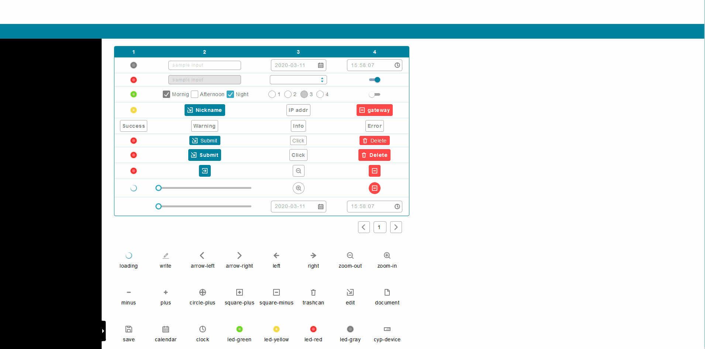

```javascript
// CYPD Notify sample code
import React from 'react';
import ReactDOM from 'react-dom';
import { Notify, Button } from 'cypd';

class App extends React.Component {
    render() {
        return ( 
            <div>
                <Button onClick={() => {
                    Notify({ 
                        title: 'Demo', 
                        context: 'This is a demostration message.', 
                        type: 'success' 
                    });
                }}>Click</Button>
            </div> 
        );
    }
}
ReactDOM.render(<App />, document.getElementById('root'));
```

### 14. <a name="14"></a>Table 表格

Properties      | Type                                              | Default value     | Description
----------------|:--------------------------------------------------|:------------------|:----------------------
headers (*)     | `Array<string | ReactNode | undefined>`           |                   | Define each column of table.
rows (*)        | `Array<Array<string | ReactNode | undefined>>`    |                   | Define each row of table.
pagination      | `boolean` \| `undefined`                          | `undefined`       | Determine the table shows contents in different page or not. 
rowLimit        | `number` \| `undefined`                           | `undefined`       | Determine how many rows can a page have, only works when `pagination` is not `undefined`
headerStyle     | `React.CSSProperties` \| `undefined`              | `undefined`       | Programmer can use this property to defined inline CSS style ***of table's header***.
bodyStyle       | `React.CSSProperties` \| `undefined`              | `undefined`       | Programmer can use this property to defined inline CSS style ***of table's rows***.


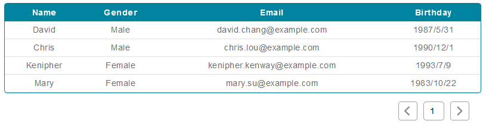

```javascript
// CYPD Table sample code
import React from 'react';
import ReactDOM from 'react-dom';
import { Table } from 'cypd';

class App extends React.Component {
    render() {
        return ( 
            <div>
                <Table
                    headers={['Name', 'Gender', 'Email', 'Birthday']}
                    rows={[
                        ['David', 'Male', 'david.chang@example.com', '1987/5/31'],
                        ['Chris', 'Male', 'chris.lou@example.com', '1990/12/1'],
                        ['Kenipher', 'Female', 'kenipher.kenway@example.com', '1993/7/9'],
                        ['Mary', 'Female', 'mary.su@example.com', '1983/10/22'],
                    ]}
                    pagination={true}
                    rowLimit={10}
                ></Table>
            </div> 
        );
    }
}
ReactDOM.render(<App />, document.getElementById('root'));
```

### 15. <a name="15"></a>Tooltip 提示框

Properties      | Type                                              | Default value     | Description
----------------|:--------------------------------------------------|:------------------|:----------------------
text (*)        | `string`                                          |                   | Define tip message.
direction       | "top" \| "bottom" \| "left" \| "right"            | "bottom"          | Define the direction of bubble appears.
className       | `string` \| `undefined`                           | `undefined`       | Programmer can use this property to defined specific CSS style.

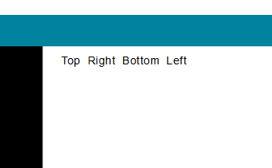

```javascript
// CYPD Tooltip sample code
import React from 'react';
import ReactDOM from 'react-dom';
import { Tooltip, Button } from 'cypd';

class App extends React.Component {
    render() {
        return ( 
            <div>
                <Tooltip 
                    text='Refresh dashboard data.'
                    direction='top'
                >
                    <Button>Refresh</Button>
                </Tooltip>
            </div> 
        );
    }
}
ReactDOM.render(<App />, document.getElementById('root'));
```

### 16. <a name="16"></a>Tree 樹狀展開結構

#### Tree

Properties      | Type                                              | Default value     | Description
----------------|:--------------------------------------------------|:------------------|:----------------------
collapsable     | `boolean` \| `undefined`                          | `false`           | Define tree is collapsable or not.
color           | "white" \| "black"                                | "white"           | Define the color of font.

#### Node

Properties      | Type                                              | Default value     | Description
----------------|:--------------------------------------------------|:------------------|:----------------------
label           | `string` \| `ReactNode` \| `undefined`            | `undefined`       | Define the context showed in this node.
collapsable     | `boolean` \| `undefined`                          | `false`           | Define tree is collapsable or not.
icon            | `string` \| `undefined`                           | `undefined`       | Define postfix icon in the node.
defaultClose    | `boolean` \| `undefined`                          | `false`           | If `defaultClose` is `true`, the node will be closed after created.
className       | `string` \| `undefined`                           | `undefined`       | Programmer can use this property to defined specific CSS style.
style           | `React.CSSProperties` \| `undefined`              | `undefined`       | Programmer can use this property to defined inline CSS style.

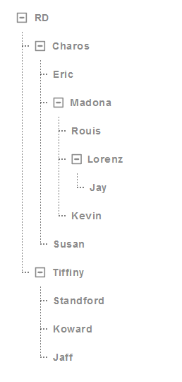

```javascript
// CYPD Tree sample code
import React from 'react';
import ReactDOM from 'react-dom';
import { Tree } from 'cypd';

class App extends React.Component {
    render() {
        return ( 
            <div>
                <Tree.Tree color='black' collapsable>
                    <Tree.Node label='RD'>
                        <Tree.Node label='Charos'>
                            <Tree.Node label='Eric'></Tree.Node>
                            <Tree.Node label='Madona'>
                                <Tree.Node label='Rouis'></Tree.Node>
                                <Tree.Node label='Lorenz'>
                                    <Tree.Node label='Jay'></Tree.Node>
                                </Tree.Node>
                                <Tree.Node label='Kevin'></Tree.Node>
                            </Tree.Node>
                            <Tree.Node label='Susan'></Tree.Node>
                        </Tree.Node>
                        <Tree.Node label='Tiffiny'>
                            <Tree.Node label='Standford'></Tree.Node>
                            <Tree.Node label='Koward'></Tree.Node>
                            <Tree.Node label='Jaff'></Tree.Node>
                        </Tree.Node>
                    </Tree.Node>
                </Tree.Tree>
            </div> 
        );
    }
}
ReactDOM.render(<App />, document.getElementById('root'));
```

### 17. <a name="17"></a>Spin 旋轉

Properties      | Type                                              | Default value     | Description
----------------|:--------------------------------------------------|:------------------|:----------------------
message         | `string` \| `undefined`                           | `undefined`       | Define message.
visible         | `boolean` \| `undefined`                          | `undefined`       | Define spin mask visible or not.
layout          | "vertical" \| "horizontal"                        | "horizontal"      | Define spin and message orientation.
className       | `string` \| `undefined`                           | `undefined`       | Programmer can use this property to defined specific CSS style.
style           | `React.CSSProperties` \| `undefined`              | `undefined`       | Programmer can use this property to defined inline CSS style.


```javascript
// CYPD Spin sample code
import React from 'react';
import ReactDOM from 'react-dom';
import { Spin } from 'cypd';

class App extends React.Component {
    render() {
        return ( 
            <div>
                <Spin message='loading'></Spin>
            </div> 
        );
    }
}
ReactDOM.render(<App />, document.getElementById('root'));
```
