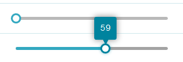

# Sider 拉霸

Properties      | Type                                              | Default value     | Description
----------------|:--------------------------------------------------|:------------------|:----------------------
value           | `number` \| `undefined`                           | `undefined`       | Determine current value of Slider
disabled        | `boolean` \| `undefined`                          | `undefined`       | Determine Slider is disabled or not.
min             | `number` \| `undefined`                           | `undefined`       | Define the lower bound of Slider
max             | `number` \| `undefined`                           | `undefined`       | Define the upper bound of Slider
step            | `number` \| `undefined`                           | `undefined`       | Define value unit
className       | `string` \| `undefined`                           | `undefined`       | Programmer can use this property to defined specific CSS style.
style           | `React.CSSProperties` \| `undefined`              | `undefined`       | Programmer can use this property to defined inline CSS style.
onChange        | `(value: number) => void` \| `undefined`          | `undefined`       | This function is triggered ***when*** draging.
onAfterChange   | `(value: number) => void` \| `undefined`          | `undefined`       | This function is triggered ***after*** draging.
layout          | "vertical" \| "horizontal"                        | "horizontal"      | Determine vertical or horizontal slider.



## Example

```javascript
// CYPD Slider sample code
import React from 'react';
import ReactDOM from 'react-dom';
import { Slider } from 'cypd';

class App extends React.Component {
    constructor(props) {
        super(props);
        this.state = {
            value: 0
        };
    }
    onChangeValue = (value: number) => {
        this.setState({ value: value });
    }
    render() {
        const { value } = this.state;
        return ( 
            <div>
                <Slider value={value} onChange={this.onChangeValue}/>
            </div> 
        );
    }
}
ReactDOM.render(<App />, document.getElementById('root'));
```

# Progress Bar 進度條

Properties      | Type                                              | Default value     | Description
----------------|:--------------------------------------------------|:------------------|:----------------------
percentage      | `number`                                          |                   | Determine current percentage of progress bar
hint            | `string` \| `React.ReactNode`                     | `undefined`       | Hint message of progress bar
className       | `string` \| `undefined`                           | `undefined`       | Programmer can use this property to defined specific CSS style.
style           | `React.CSSProperties` \| `undefined`              | `undefined`       | Programmer can use this property to defined inline CSS style.


## Example

```javascript
// CYPD ProgressBar sample code
import React from 'react';
import ReactDOM from 'react-dom';
import { ProgressBar } from 'cypd';

class App extends React.Component {
    constructor(props) {
        super(props);
        this.state = {
            progress: 0
        };
        this.testProgress = setInterval(() => {
            if (this.state.progress < 100)
                this.setState((prevState) => ({ progress: prevState.progress + 2 }));
            else
                clearInterval(this.testProgress);
        }, 100);
    }
    onChangeProgress = (value: number) => {
        this.setState({ value: value });
    }
    render() {
        const { progress } = this.state;
        return ( 
            <div>
                <ProgressBar percentage={progress} hint={`${progress}%`}
            </div> 
        );
    }
}
ReactDOM.render(<App />, document.getElementById('root'));
```