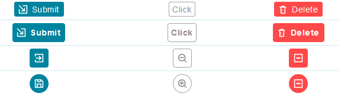

# Button 按鍵

Properties      | Type                                              | Default value     | Description
----------------|:--------------------------------------------------|:------------------|:----------------------
type            | "default" \| "primary" \| "danger"                | "default"         | Determine button style.
icon            | `string`                                          | `undefined`       | Determine button prefix icon.
iconColor       | `string`                                          | `undefined`       | Determine the icon color by CSS color properties.
size            | "normal" \| "small"                               | "normal"          | Determine button's size (Only 2 options. if you want somthing else, please check `className` or `style` properties).
shape           | "round" \| `undefined`                            | `undefined`       | Determine button's shape.
disabled        | `boolean` \| `undefined`                          | `undefined`       | Determine button is disabled or not.
className       | `string` \| `undefined`                           | `undefined`       | Programmer can use this property to defined specific CSS style.
style           | `React.CSSProperties` \| `undefined`              | `undefined`       | Programmer can use this property to defined inline CSS style.
onClick         | `(e: React.MouseEvent) => void` \| `undefined`    | `undefined`       | The handle function of clicking action
tooltip         | `string` \| `undefined`                           | `undefined`       | Display a hover message of button.
tooltipFixedWidth| `string` \| `number` \| `undefined`              | `undefined`       | Fix the popup bubble's width if you want.
tooltipDirection| See `Tooltip` component                           | `top`               | Determine where the bubble appears.



## Example

```javascript
// CYPD Button sample code
import React from 'react';
import ReactDOM from 'react-dom';
import { Button } from 'cypd';

class App extends React.Component {
    render() {
        return ( 
            <div>
                <Button type="primary">Submit</Button>
                <Button type="default">Edit</Button>
                <Button type="danger">Delete</Button>
            </div> 
        );
    }
}
ReactDOM.render(<App />, document.getElementById('root'));
```
