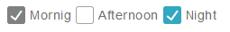
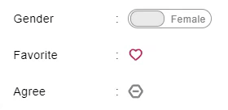

# Checkbox 勾選方塊

Properties      | Type                                              | Default value     | Description
----------------|:--------------------------------------------------|:------------------|:----------------------
label           | `string` \| `undefined`                           | `undefined`       | Determine Checkbox's label.
checked         | `boolean` \| `undefined`                          | `undefined`       | Determine Checkbox is checked or not.
disabled        | `boolean` \| `undefined`                          | `undefined`       | Determine Checkbox is disabled or not.
readOnly        | `boolean` \| `undefined`                          | `undefined`       | Make Checkbox read-only when this property is true.
className       | `string` \| `undefined`                           | `undefined`       | Programmer can use this property to defined specific CSS style.
style           | `React.CSSProperties` \| `undefined`              | `undefined`       | Programmer can use this property to defined inline CSS style.
checkedType     | "v-line" \| "square"                              | "v-line"          | Determine the check style of component
onChange        | `(e: React.ChangeEvent<HTMLInputElement>) => void` \| `undefined`    | `undefined`       | This function is triggered after component is clicked.



## Example

```javascript
// CYPD Checkbox sample code
import React from 'react';
import ReactDOM from 'react-dom';
import { Checkbox } from 'cypd';

class App extends React.Component {
    render() {
        return ( 
            <div>
                <Checkbox readOnly label='Mornig' disabled checked></Checkbox>
                <Checkbox label='Afternoon'></Checkbox>
                <Checkbox readOnly checked label='Night'></Checkbox>
            </div> 
        );
    }
}
ReactDOM.render(<App />, document.getElementById('root'));
```

# Switch Button 二元切換鍵

Properties      | Type                                              | Default value     | Description
----------------|:--------------------------------------------------|:------------------|:----------------------
label           | `[string | React.ReactNode, string | React.ReactNode]` \| `undefined` | `undefined` | Determine label in both side. Rule: [ true label, false label ].
checked         | `boolean` \| `undefined`                          | `undefined`       | Determine status is true or false.
defaultChecked  | `boolean` \| `undefined`                          | `undefined`       | Determine status is true by default or not.
disabled        | `boolean` \| `undefined`                          | `undefined`       | Determine component is disabled or not.
readOnly        | `boolean` \| `undefined`                          | `undefined`       | Make component read-only when this property is true.
className       | `string` \| `undefined`                           | `undefined`       | Programmer can use this property to defined specific CSS style.
style           | `React.CSSProperties` \| `undefined`              | `undefined`       | Programmer can use this property to defined inline CSS style.
type            | "hexigon" \| "heart" \| "normal" \| `undefined`   | "normal"          | Determine the button style of component
onChange        | `(e: React.ChangeEvent<HTMLInputElement>) => void` \| `undefined`    | `undefined`       | This function is triggered after component is clicked.



## Example

```javascript
// CYPD SwitchButton sample code
import React from 'react';
import ReactDOM from 'react-dom';
import { Form, SwitchButton } from 'cypd';

class App extends React.Component {
    render() {
        return ( 
            <Form.Form>
                <Form.Item label='Gender'>
                    <SwitchButton label={[ 'Male', 'Female' ]}/>
                </Form.Item>
                <Form.Item label='Favorite'>
                    <SwitchButton type='heart'/>
                </Form.Item>
                <Form.Item label='Agree'>
                    <SwitchButton type='hexigon'/>
                </Form.Item>
            </Form.Form> 
        );
    }
}
ReactDOM.render(<App />, document.getElementById('root'));
```
