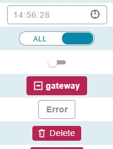
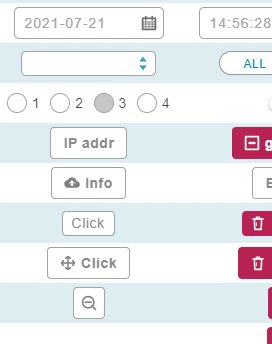

# Time Picker 時間選擇器

Properties      | Type                                              | Default value     | Description
----------------|:--------------------------------------------------|:------------------|:----------------------
value           | `Date` \| `undefined`               				| Current time	    | Determine the current time value.
format          | `string` \| `undefined`  							| "HH:mm:ss" 		| Determine how to represent time with pure text. The "HH" keyword will be replaced with hour value, the "mm" keyworkd will be replaced with minute value, and the "ss" keyword will be replaced with second value.
className       | `string` \| `undefined`                           | `undefined`       | Programmer can use this property to defined specific CSS style.
style           | `React.CSSProperties` \| `undefined`              | `undefined`       | Programmer can use this property to defined inline CSS style.
clockSystem     | "12-hour" \| "24-hour"  \| `undefined`  			| "24-hour"         | Determine the clock system of display text.
disabled     	| `boolean` \| `undefined`   					    | `undefined`       | Determine component is disabled or not.
onChange     	| `(date: Date) => void` \| `undefined`   			| `undefined`       | The callback function which will be called when value change.



## Example

```javascript
// CYPD TimePicker sample code
import React from 'react';
import ReactDOM from 'react-dom';
import { DateTime } from 'cypd';

class App extends React.Component {
    render() {
        return ( 
            <div>
				<DateTime.TimePicker />
            </div> 
        );
    }
}
ReactDOM.render(<App />, document.getElementById('root'));
```

# Date Picker 日期選擇器

Properties      | Type                                              | Default value     | Description
----------------|:--------------------------------------------------|:------------------|:----------------------
value           | `Date` \| `undefined`               				| Current date	    | Determine the current date value.
format          | `string` \| `undefined`  							| "YYYY-MM-DD" 		| Determine how to represent date with pure text. The "YYYY" keyword will be replaced with year value, the "MM" keyworkd will be replaced with month value, and the "DD" keyword will be replaced with day value.
className       | `string` \| `undefined`                           | `undefined`       | Programmer can use this property to defined specific CSS style.
style           | `React.CSSProperties` \| `undefined`              | `undefined`       | Programmer can use this property to defined inline CSS style.
disabled     	| `boolean` \| `undefined`   					    | `undefined`       | Determine component is disabled or not.
onChange     	| `(date: Date) => void` \| `undefined`   			| `undefined`       | The callback function which will be called when value change.



## Example

```javascript
// CYPD DatePicker sample code
import React from 'react';
import ReactDOM from 'react-dom';
import { DateTime } from 'cypd';

class App extends React.Component {
    render() {
        return ( 
            <div>
				<DateTime.DatePicker />
            </div> 
        );
    }
}
ReactDOM.render(<App />, document.getElementById('root'));
```

# DateTime.FormatDateTime(date[, format[, clockSystem]])

## Description

Translate `Date` variables to string with specific format. Keyword table:

Keyworkd      	| Description
----------------|:----------------------
YYYY          	| Year value in four number.
MM          	| Month value in two number.
DD          	| Day value in two number.
HH          	| Hour value in two number. Notice that if parameter `clockSystem` is "12-hour", this value has a maximum 11.
mm          	| Minute value in two number.
ss          	| Second value in two number.
sss          	| Millisecond value in three number.

## Parameters

- date: Javascript `Date` object.
- format: Javascript `string` object to represent output format. The replacement keyword is mentioned in description. The default format is "YYYY-MM-DD HH:mm:ss".
- clockSystem: Value of "12-hour" or "24-hour".

## Return

Formatted string object.

# DateTime.ParseDateTime(str[, format])

## Description

Translate `string` variables to `Date` object with specific format. Keyword table:

Keyworkd      	| Description
----------------|:----------------------
YYYY          	| Year value in four number.
MM          	| Month value in two number.
DD          	| Day value in two number.
HH          	| Hour value in two number. Notice that if parameter `clockSystem` is "12-hour", this value has a maximum 11.
mm          	| Minute value in two number.
ss          	| Second value in two number.
sss          	| Millisecond value in three number.

## Parameters

- str: Javascript `string` object.
- format: Javascript `string` object to represent output format. The replacement keyword is mentioned in description. The default format is "YYYY-MM-DD HH:mm:ss".

## Return

A javascript `Date` object translated from specific format. Retrun `undefined` when the string is invalid.