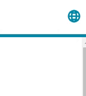

# Dropdown 下拉內容

Properties      | Type                                              | Default value     | Description
----------------|:--------------------------------------------------|:------------------|:----------------------
children       	| `Array<DropdownItemProps>`              			| 	    			| Dropdown item array.
parent          | `React.ReactNode` \| `(() => React.ReactNode)`  	|  					| Element shown before children are extended.
className       | `string` \| `undefined`                           | `undefined`       | Programmer can use this property to defined specific CSS style.
style           | `React.CSSProperties` \| `undefined`              | `undefined`       | Programmer can use this property to defined inline CSS style.

## DropdownItemProps

Properties      | Type                                              | Default value     | Description
----------------|:--------------------------------------------------|:------------------|:----------------------
icon           	| `IconProps` \| `undefined`               			| `undefined`	    | Describe the prefix icon, See `IconProps`.
label           | `string` \| `undefined`  							| `undefined` 		| Determine label text of item.
className       | `string` \| `undefined`                           | `undefined`       | Programmer can use this property to defined specific CSS style.
style           | `React.CSSProperties` \| `undefined`              | `undefined`       | Programmer can use this property to defined inline CSS style.
onClick     	| `((event: React.MouseEvent<HTMLDivElement, MouseEvent>) => void)` \| `undefined`   			| `undefined`       | The callback function when element is clicked.



## Example

```javascript
// CYPD Dropdown sample code
import React from 'react';
import ReactDOM from 'react-dom';
import { Dropdown, Icon } from 'cypd';

class App extends React.Component {
    render() {
        return ( 
            <div>
                <Dropdown
                    parent={<Icon type='earth' color='#008AAB' style={{ transform: 'scale(1.3)' }}/>}
                    children={[
                        { label: 'Chinese', icon: { type: 'dashboard', color: '#008aab' } },
                        { label: 'English', icon: { type: 'scene', color: '#008aab' } },
                        { label: 'Japanese', icon: { type: 'calendar', color: '#008aab' } },
                    ]}
                    style={{ marginRight: '20px' }}
                />
            </div> 
        );
    }
}
ReactDOM.render(<App />, document.getElementById('root'));
```
