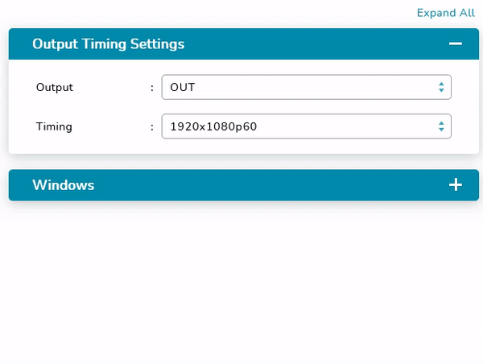

# Flat 平面規劃

## Playground

Properties      | Type                                              | Default value     | Description
----------------|:--------------------------------------------------|:------------------|:----------------------
hasExtendToggler| `boolean` \| `undefined`                          | `undefined`       | If this property is true, at the top of the `Playground` component, a toggler that can extend/collapse the internal `Section` component will appear.
loading         | `boolean` \| `undefined`                          | `undefined`       | If this property is true, the context of `Playground` component will be masked with a `Spin` component.
className       | `string` \| `undefined`                           | `undefined`       | Programmer can use this property to defined specific CSS style.
style           | `React.CSSProperties` \| `undefined`              | `undefined`       | Programmer can use this property to defined inline CSS style.
contextStyle    | `React.CSSProperties` \| `undefined`              | `undefined`       | Programmer can use this property to defined inline CSS style of `Playground` context.

## Section

Properties      | Type                                              | Default value     | Description
----------------|:--------------------------------------------------|:------------------|:----------------------
title           | `React.ReactNode` \| `string` \| `undefined`      | `undefined`       | Define section title.
disableCollapsed| `boolean` \| `undefined`                          | `undefined`       | Disable the collapse function of `Section` component.
extend          | `boolean` \| `undefined`                          | `undefined`       | Determine whether this section extended or not.
defaultExtend   | `boolean` \| `undefined`                          | `undefined`       | Determine whether this section default extended or not.
className       | `string` \| `undefined`                           | `undefined`       | Programmer can use this property to defined specific CSS style.
style           | `React.CSSProperties` \| `undefined`              | `undefined`       | Programmer can use this property to defined inline CSS style.
contextStyle    | `React.CSSProperties` \| `undefined`              | `undefined`       | Programmer can use this property to defined inline CSS style of `Section` context.
titleStyle      | `React.CSSProperties` \| `undefined`              | `undefined`       | Programmer can use this property to defined inline CSS style of `Section` title.

## Field

Properties      | Type                                              | Default value     | Description
----------------|:--------------------------------------------------|:------------------|:----------------------
title           | `React.ReactNode` \| `string` \| `undefined`      | `undefined`       | Define section title.
className       | `string` \| `undefined`                           | `undefined`       | Programmer can use this property to defined specific CSS style.
style           | `React.CSSProperties` \| `undefined`              | `undefined`       | Programmer can use this property to defined inline CSS style.
contextStyle    | `React.CSSProperties` \| `undefined`              | `undefined`       | Programmer can use this property to defined inline CSS style of `Field` context.
titleStyle      | `React.CSSProperties` \| `undefined`              | `undefined`       | Programmer can use this property to defined inline CSS style of `Field` title.



## Example

```javascript
// CYPD Flat sample code
import React from 'react';
import ReactDOM from 'react-dom';
import { Flat } from 'cypd';

class App extends React.Component {
    constructor(props) {
        super(props);
        this.state = {
            name: '',
            address: '',
        }
    }
    render() {
        return ( 
            <Flat.Playground contextStyle={{ height: 'auto' }} hasExtendToggler>
                <Flat.Section title='Section Demo'>
                    <Form.Form labelStyle={{ width: '130px' }}>
                        <Form.Item label='Name'>
                            <Input 
                                value={this.state.name} 
                                onChange={(e) => { this.setState({ name: e.target.value }); }}
                            ></Input>
                        </Form.Item>
                    </Form.Form>
					<Flat.Field title='Field Demo'>
						<Form.Form labelStyle={{ width: '130px' }}>
							<Form.Item label='Address'>
								<Input 
									value={this.state.address} 
									onChange={(e) => { this.setState({ address: e.target.value }); }}
								></Input>
							</Form.Item>
						</Form.Form>
					</Flat.Field>
                </Flat.Section>
            </Flat.Playground>
        );
    }
}
ReactDOM.render(<App />, document.getElementById('root'));
```