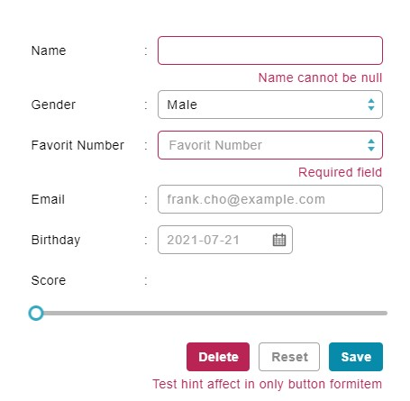

# Form 表單

## Form.Form

Properties      | Type                                              | Default value     | Description
----------------|:--------------------------------------------------|:------------------|:----------------------
colon           | `boolean` \| `undefined`                          | `undefined`       | Define whether a ":" character will be placed after label or not. All child items below this form will use this value.
layout          | "vertical" \| "horizontal"                        | "horizontal"      | Define the orientation of component. All child items below this form will use this value.
className       | `string` \| `undefined`                           | `undefined`       | Programmer can use this property to defined specific CSS style.
style           | `React.CSSProperties` \| `undefined`              | `undefined`       | Programmer can use this property to defined inline CSS style.
labelClass      | `string` \| `undefined`                           | `undefined`       | Programmer can use this property to defined specific CSS style of all item label in this form.
labelStyle      | `React.CSSProperties` \| `undefined`              | `undefined`       | Programmer can use this property to defined inline CSS style of all item label in this form.
disabled        | `boolean` \| `undefined`                          | `undefined`       | All form item in this form will using this value, except for it defines itself's disabled property.

## Form.Item

Properties      | Type                                              | Default value     | Description
----------------|:--------------------------------------------------|:------------------|:----------------------
label           | `string` \| `React.ReactNode` \| `undefined`      | `undefined`       | Define title of this form row.
colon           | `boolean` \| `undefined`                          | `undefined`       | Define whether a ":" character will be placed after label or not.
layout          | "vertical" \| "horizontal"                        | "horizontal"      | Define the orientation of component.
className       | `string` \| `undefined`                           | `undefined`       | Programmer can use this property to defined specific CSS style.
style           | `React.CSSProperties` \| `undefined`              | `undefined`       | Programmer can use this property to defined inline CSS style.
labelClass      | `string` \| `undefined`                           | `undefined`       | Programmer can use this property to defined specific CSS style of label.
labelStyle      | `React.CSSProperties` \| `undefined`              | `undefined`       | Programmer can use this property to defined inline CSS style label.
error           | `string` \| `undefined`                           | `undefined`       | When error property is defined, this form row will show an error message.
disabled        | `boolean` \| `undefined`                          | `undefined`       | Disable all CYPD component in this form row.



## Example

```javascript
// CYPD Form sample code
import React from 'react';
import ReactDOM from 'react-dom';
import { Form, Input, Select, Option, DateTime } from 'cypd';

class App extends React.Component {
    constructor(props) {
        super(props);
        this.state = {
            name: '',
            email: '',
            gender: '1',
            birthday: new Date()
        }
    }
    render() {
        return ( 
            <div style={{ width: '300px' }}>
                <Form.Item label={<span style={{display: 'inline-block', width: '55.5px'}}>Name</span>}>
                    <Input 
                        value={this.state.name} 
                        onChange={(e) => { this.setState({ name: e.target.name }); }}
                    ></Input>
                </Form.Item>
                <Form.Item label={<span style={{display: 'inline-block', width: '55.5px'}}>Gender</span>}>
                    <Select value={this.state.gender} onChange={(v) => { this.setState({ gender: v }); }}>
                        <Option value='1'>Male</Option>
                        <Option value='2'>Female</Option>
                    </Select>
                </Form.Item>
                <Form.Item label={<span style={{display: 'inline-block', width: '55.5px'}}>Email</span>}>
                    <Input
                        value={this.state.email}
                        placeholder="frank.cho@example.com"
                        onChange={(e) => { this.setState({ email: e.target.name }); }}
                    ></Input>
                </Form.Item>
                <Form.Item label='Birthday'>
                    <DateTime.DatePicker 
                        value={this.state.birthday} 
                        onChange={(date) => { this.setState({ birthday: date }); }} 
                    ></DateTime.DatePicker>
                </Form.Item>
            </div>
        );
    }
}
ReactDOM.render(<App />, document.getElementById('root'));
```