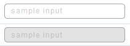

# Input 文字輸入框

Properties      | Type                                              | Default value     | Description
----------------|:--------------------------------------------------|:------------------|:----------------------
value           | `string` \| `number`                              | `undefined`       | Determine Input value.
size            | "normal" \| "small"                               | "normal"          | Determine Input's size (Only 2 options. if you want somthing else, please check `className` or `style` properties).
placeholder     | `string`                                          | `undefined`       | Content showed when value is empty.
disabled        | `boolean` \| `undefined`                          | `undefined`       | Determine Input is disabled or not.
defaultValue    | `string` \| `number`                              | `undefined`       | You should use either `value` property or this (choose one).
readOnly        | `boolean` \| `undefined`                          | `undefined`       | Make input read-only when this property is true.
className       | `string` \| `undefined`                           | `undefined`       | Programmer can use this property to defined specific CSS style.
style           | `React.CSSProperties` \| `undefined`              | `undefined`       | Programmer can use this property to defined inline CSS style.
onChange        | `(e: React.ChangeEvent<HTMLInputElement>) => void` \| `undefined`    | `undefined`       | This function is triggered when typing.
onBlur          | `(e: React.FocusEvent<HTMLInputElement>) => void` \| `undefined`    | `undefined`       | This function is triggered when unfocusing.
onKeyPress      | `(e: React.KeyboardEvent<HTMLInputElement>) => void` \| `undefined`    | `undefined`       | This function is triggered when pressing keyboard.
onMouseDown     | `(e: React.MouseEvent<HTMLInputElement>) => void` \| `undefined`    | `undefined`       | This function is triggered when mouse clicking.
onMouseUp     	| `(e: React.MouseEvent<HTMLInputElement>) => void` \| `undefined`    | `undefined`       | This function is triggered after a mouse click.
onMouseLeave    | `(e: React.MouseEvent<HTMLInputElement>) => void` \| `undefined`    | `undefined`       | This function is triggered when mouse hover-out.
onMouseEnter    | `(e: React.MouseEvent<HTMLInputElement>) => void` \| `undefined`    | `undefined`       | This function is triggered when mouse hover-in.



## Example

```javascript
// CYPD Input sample code
import React from 'react';
import ReactDOM from 'react-dom';
import { Input } from 'cypd';

class App extends React.Component {
    constructor(props) {
        super(props);
        this.state = { value1: '', value2: '' };
    }
    handler1 = (e) => {
        this.setState({ value1: e.target.value });
    } 
    render() {
        return ( 
            <div>
                <Input value={this.state.value1} onChange={this.handler1}></Input>
                <Input value={this.state.value2} disabled></Input>
            </div> 
        );
    }
}
ReactDOM.render(<App />, document.getElementById('root'));
```