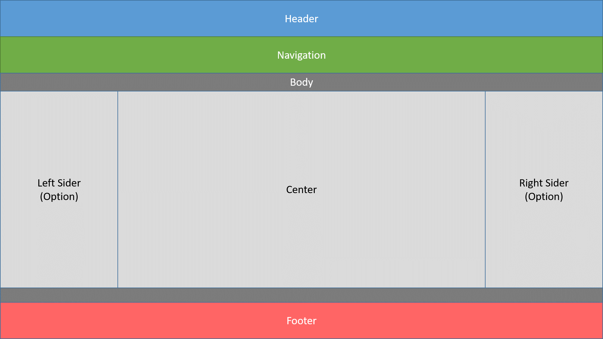
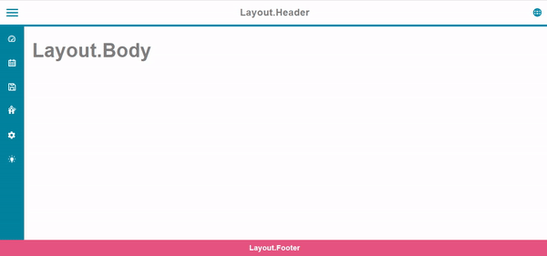

# Layout 布局




## Layout.Layout

We must use `Layout.Layout` component to wrap all CYPD layout element.

## Layout.Header

A header wrapper in CYPD layout.

## Layout.Navigation

A middle layer between `Layout.Header` and `Layout.Body`. Notice that this component currently cannot wrap `Layout.NavigationItem`.

## Layout.Body

A middle layer between `Layout.Header` and `Layout.Footer`

## Layout.Sider

Properties      | Type                                              | Default value     | Description
----------------|:--------------------------------------------------|:------------------|:----------------------
direction       | "left" \| "right"                                 | "left"            | Sider appears in left/right of center context
customizedToggler| `React.ReactNode` \| `undefined`       			| `undefined`       | If this property is defined, the sider will replace default toggler with this object.
className       | `string` \| `undefined`                           | `undefined`       | Programmer can use this property to defined specific CSS style.
style           | `React.CSSProperties` \| `undefined`              | `undefined`       | Programmer can use this property to defined inline CSS style.
togglerClass    | `string` \| `undefined`                           | `undefined`       | Programmer can use this property to defined specific CSS style of sider's toggler.
togglerStyle    | `React.CSSProperties` \| `undefined`              | `undefined`       | Programmer can use this property to defined inline CSS style of sider's toggler.
togglerTooltip  | `string` \| `undefined`              				| `undefined`       | If this property is defined, the sider toggler will show a hint message when hovering on it.
togglerTooltipDirection  | "top" \| "bottom" \| "left" \| "left" \| "top-right" \| "top-left" \| "right-top" \| "right-bottom" \| "bottom-right" \| "bottom-left" \| "left-bottom" \| "left-top" \| `undefined` | `undefined`       | See `Tooltip`.

### Layout.NavigationItem

A hierarchical component used in `Layout.Sider`. 

The definition of `NavitemProps` type:

Properties      | Type                                              | Default value     | Description
----------------|:--------------------------------------------------|:------------------|:----------------------
label       	| `string`                          				| 			        | Name of navigation node.
icon            | `string` \| `undefined`                           | `undefined`       | Determine which icon.
url            	| `string` \| `undefined`                           | `undefined`       | If this property is defined, the page will jump to this URL after clicking.
disabled        | `boolean` | `undefined`                           | `undefined`       | Determine sider visible or not
children		| `Array<NavitemProps>` \| `undefined`       		| `undefined`       | Definition the navigating option under this node.
className       | `string` \| `undefined`                           | `undefined`       | Programmer can use this property to defined specific CSS style.
style           | `React.CSSProperties` \| `undefined`              | `undefined`       | Programmer can use this property to defined inline CSS style.
tooltip  		| `string` \| `undefined`              				| `undefined`       | If this property is defined, the sider toggler will show a hint message when hovering on it.
tooltipDirection| "top" \| "bottom" \| "left" \| "left" \| "top-right" \| "top-left" \| "right-top" \| "right-bottom" \| "bottom-right" \| "bottom-left" \| "left-bottom" \| "left-top" \| `undefined` | `undefined`       | See `Tooltip`.
tooltipFixedWidth| `number` \| `string` \| `undefined`				| `undefined`		| See `Tooltip`.
onClick         | `() => void` \| `undefined`    					| `undefined`       | The handle function of clicking action

## Layout.Center

The main view of web application.

## Layout.Footer

The last layer of CYPD layout

## Example

```javascript
// CYPD Layout sample code
import React from 'react';
import ReactDOM from 'react-dom';
import { Layout } from 'cypd';

class App extends React.Component {
    render() {
        return ( 
            <div style={{ height: 100%, width: 100% }}>
                <Layout.Header />
                <Layout.Navigation />
                <Layout.Body>
                    <Layout.Sider>
                        <Layout.NavigationItem icon='dashboard' label='NavigationItem 1' children={[ { label: 'Level2 1' }, { label: 'Level2 2' }, { label: 'Level2 3' } ]} />
                        <Layout.NavigationItem icon='calendar' label='NavigationItem 2'/>
                        <Layout.NavigationItem icon='save' label='NavigationItem 3' children={[ { label: 'Level2 1' }, { label: 'Level2 2' }, { label: 'Level2 3' } ]} />
                        <Layout.NavigationItem icon='scenario' label='NavigationItem 4'/>
                        <Layout.NavigationItem icon='setting' label='NavigationItem 5'/>
                        <Layout.NavigationItem icon='idea' label='NavigationItem 6'/>
                    </Layout.Sider>
                    <Layout.Center>
                    </Layout.Center>
                </Layout.Body>
                <Layout.Footer />
            </div> 
        );
    }
}
ReactDOM.render(<App />, document.getElementById('root'));
```