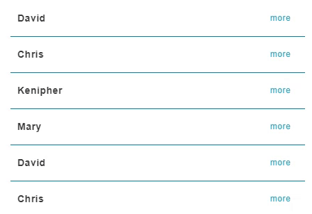

# List 列表

Properties      | Type                                              | Default value     | Description
----------------|:--------------------------------------------------|:------------------|:----------------------
items           | `Array<ListItemProperties>`                       |    		        | Array of list items.
className       | `string` \| `undefined`                           | `undefined`       | Programmer can use this property to defined specific CSS style.
style           | `React.CSSProperties` \| `undefined`              | `undefined`       | Programmer can use this property to defined inline CSS style.
draggable       | `boolean` \| `undefined`              			| `undefined`       | List become draggable when this property is true.
theme       	| "normal" \| "dark" \| `undefined`              	| "normal"       	| Dark style or light style.
onAfterDrag		| `(new_order: Array<string>) => void` \| `undefined`| `undefined`		| Callback function of a drag event. Parameter is a new order of items' index. See `ListItemProperties.index`.

## ListItemProperties

Properties      | Type                                              | Default value     | Description
----------------|:--------------------------------------------------|:------------------|:----------------------
label       	| `string`                          				| 			        | Name of list item.
description     | `React.ReactNode` \| `undefined`                  | `undefined`       | If this property is defiend, the list item will create a collapsable detail block to wrap it.
decoration      | `React.ReactNode` \| `undefined`              	| `undefined`       | Define the postfix of list item.
index       	| `string` \| `undefined`              				| 			        | If an `onAfterDrag` callback is defined on `List` component, this parameter will be brought into the callback function, and the programmer can know which order each item is re-arranged to. Default value is the native index in array.



## Example

```javascript
// CYPD List sample code
import React from 'react';
import ReactDOM from 'react-dom';
import { List } from 'cypd';

class App extends React.Component {
    render() {
        return ( 
            <div>                                
                <List
                    draggable={true}
                    onAfterDrag={undefined}
                    items={[
                        { label: 'David', index: 'David', description: 'david.chang@example.com' },
                        { label: 'Chris', index: 'Chris', description: 'chris.lou@example.com' },
                        { label: 'Kenipher', index: 'Kenipher', description: 'kenipher.kenway@example.com' },
                        { label: 'Mary', index: 'Mary', description: 'mary.su@example.com' },
                    ]}
                />
            </div> 
        );
    }
}
ReactDOM.render(<App />, document.getElementById('root'));
```