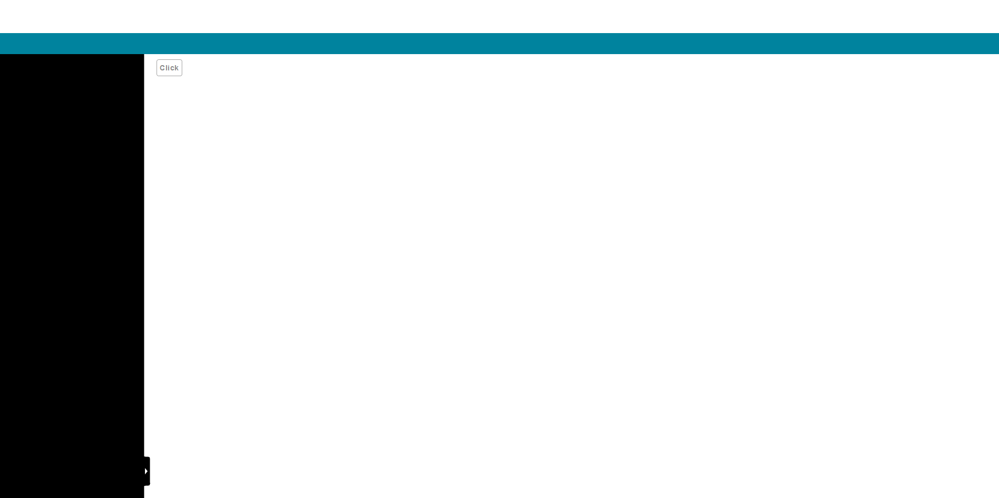

# Modal 對話視窗

Properties      | Type                                              | Default value     | Description
----------------|:--------------------------------------------------|:------------------|:----------------------
title           | `string` \| `undefined`                           | `undefined`       | Determine the title of modal. If `title` is `undefined`, pop-up modal will not have a title.
visible         | `boolean` \| `undefined`                          | `undefined`       | Determine modal is visible or not.
className       | `string` \| `undefined`                           | `undefined`       | Programmer can use this property to defined specific CSS style.
style           | `React.CSSProperties` \| `undefined`              | `undefined`       | Programmer can use this property to defined inline CSS style.
headerStyle     | `React.CSSProperties` \| `undefined`              | `undefined`       | Programmer can use this property to defined inline CSS style ***of modal's title***.
bodyStyle       | `React.CSSProperties` \| `undefined`              | `undefined`       | Programmer can use this property to defined inline CSS style ***of modal's inner body***.
onClose         | `(e: React.MouseEvent) => void` \| `undefined`    | `undefined`       | If `onClose` is not `undefined`, user can close modal by clicking "x" button or mask behind modal.



## Example

```javascript
// CYPD Modal sample code
import React from 'react';
import ReactDOM from 'react-dom';
import { Modal, Button } from 'cypd';

class App extends React.Component {
    constructor(props) {
        super(props);
        this.state = { popup: false };
    }
    open = () => { this.setState({ popup: true }); }
    close = () => { this.setState({ popup: false }); }
    render() {
        return ( 
            <div>
                <Button onClick={this.open}>Click</Button>
                <Modal
                    visible={this.state.popup}
                    onClose={this.close}
                    title='Demostration'
                >
                    This is a CYPD demostration
                </Modal>
            </div> 
        );
    }
}
ReactDOM.render(<App />, document.getElementById('root'));
```