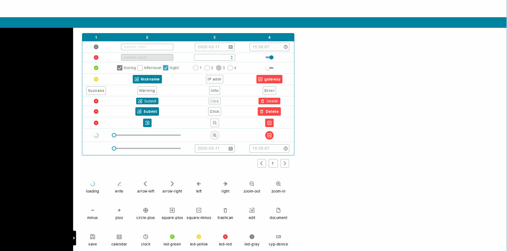

# Notify 通知

Properties      | Type                                              | Default value     | Description
----------------|:--------------------------------------------------|:------------------|:----------------------
title (*)       | `string`                                          |                   | Notification's title.
context (*)     | `string`                                          |                   | Notification's message.
type            | "success" \| "info" \| "warning" \| "error"       | "info"            | Notification's type.
timeout (ms)    | `number` \| `undefined`                           | 5000              | Disappearing timeout.



## Example

```javascript
// CYPD Notify sample code
import React from 'react';
import ReactDOM from 'react-dom';
import { Notify, Button } from 'cypd';

class App extends React.Component {
    render() {
        return ( 
            <div>
                <Button onClick={() => {
                    Notify({ 
                        title: 'Demo', 
                        context: 'This is a demostration message.', 
                        type: 'success' 
                    });
                }}>Click</Button>
            </div> 
        );
    }
}
ReactDOM.render(<App />, document.getElementById('root'));
```