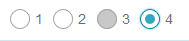

# Radio Group 單選群組

Properties      | Type                                              | Default value     | Description
----------------|:--------------------------------------------------|:------------------|:----------------------
options (*)     | `RadioOption` (below)                             |                   | Determine the radio amount and state
layout          | "vertical" \| "horizontal"                        | "horizontal"      | Determine RadioGroup orientation
value           | `string` \| `undefined`                           | `undefined`       | Determine current value of RadioGroup
defaultValue    | `string` \| `undefined`                           | `undefined`       | Determine default value of RadioGroup. Priority is lower than `value` property.
className       | `string` \| `undefined`                           | `undefined`       | Programmer can use this property to defined specific CSS style.
style           | `React.CSSProperties` \| `undefined`              | `undefined`       | Programmer can use this property to defined inline CSS style.
onChange        | `(value: string) => void` \| `undefined`          | `undefined`       | This function is triggered after clicking.

## RadioOption

Properties      | Type                                              | Default value     | Description
----------------|:--------------------------------------------------|:------------------|:----------------------
value (*)       | `string`                                          |                   | Define radio value
label           | `string` \| `React.ReactNode` \| `undefined`      | `undefined`       | Determine label of radio
disabled        | `boolean` \| `undefined`                          | `undefined`       | Determine option is disabled or not.



## Example

```javascript
// CYPD RadioGroup sample code
import React from 'react';
import ReactDOM from 'react-dom';
import { RadioGroup } from 'cypd';

class App extends React.Component {
    render() {
        return ( 
            <div>
                <RadioGroup 
                    options={[
                        { value: '1', label: '1' }, 
                        { value: '2', label: '2' }, 
                        { value: '3', label: '3', disabled: true }, 
                        { value: '4', label: '4' }
                    ]} 
                />
            </div> 
        );
    }
}
ReactDOM.render(<App />, document.getElementById('root'));
```