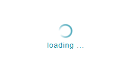

# Spin 旋轉

Properties      | Type                                              | Default value     | Description
----------------|:--------------------------------------------------|:------------------|:----------------------
message         | `string` \| `undefined`                           | `undefined`       | Define message.
visible         | `boolean` \| `undefined`                          | `undefined`       | Define spin mask visible or not.
layout          | "vertical" \| "horizontal"                        | "horizontal"      | Define spin and message orientation.
className       | `string` \| `undefined`                           | `undefined`       | Programmer can use this property to defined specific CSS style.
style           | `React.CSSProperties` \| `undefined`              | `undefined`       | Programmer can use this property to defined inline CSS style.
type           	| "linear" \| `undefined`              				| `undefined`       | Use different loading animation. Currently prefer using "linear".

## Default Type



## Linear Type


## Example

```javascript
// CYPD Spin sample code
import React from 'react';
import ReactDOM from 'react-dom';
import { Spin } from 'cypd';

class App extends React.Component {
    render() {
        return ( 
            <div>
                <Spin message='loading'></Spin>
            </div> 
        );
    }
}
ReactDOM.render(<App />, document.getElementById('root'));
```