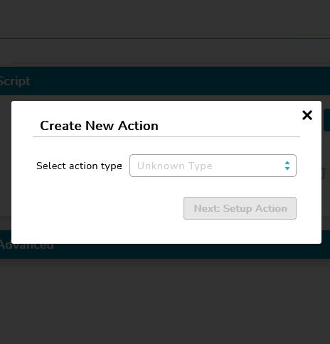

# Book 書

## Book

Properties      | Type                                              | Default value     | Description
----------------|:--------------------------------------------------|:------------------|:----------------------
page         	| `number` \| `undefined`                           | 0       			| Define current page number in `Book` component.
className       | `string` \| `undefined`                           | `undefined`       | Programmer can use this property to defined specific CSS style.
style           | `React.CSSProperties` \| `undefined`              | `undefined`       | Programmer can use this property to defined inline CSS style.

## Page

Properties      | Type                                              | Default value     | Description
----------------|:--------------------------------------------------|:------------------|:----------------------
className       | `string` \| `undefined`                           | `undefined`       | Programmer can use this property to defined specific CSS style.
style           | `React.CSSProperties` \| `undefined`              | `undefined`       | Programmer can use this property to defined inline CSS style.



## Example

```javascript
// CYPD Book & Page sample code
import React from 'react';
import ReactDOM from 'react-dom';
import { Book, Page } from 'cypd';

class App extends React.Component {
    constructor(props) {
        super(props);
        this.state = { page: 0 };
    }
	goto = (v: number) => {
		this.setState({ page: v });
	}
    render() {
		const { page } = this.state;
        return ( 
            <div>
				<div onClick={() => { this.goto(0); }}>Go to Page 1</div>
				<div onClick={() => { this.goto(1); }}>Go to Page 2</div>
                <Book page={page}>
					<Page>This is page 1</Page>
					<Page>This is page 2</Page>
                </Book>
            </div> 
        );
    }
}
ReactDOM.render(<App />, document.getElementById('root'));
```