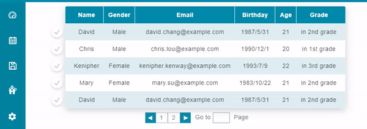
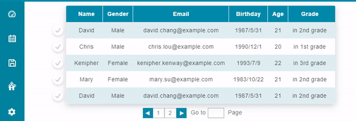

# Table 表格

Properties      | Type                                              | Default value     | Description
----------------|:--------------------------------------------------|:------------------|:----------------------
className       | `string` \| `undefined`                           | `undefined`       | Programmer can use this property to defined specific CSS style.
headers (*)     | `Array<string \| ReactNode \| undefined>`         |                   | Define each column of table.
rows (*)        | `Array<Array<string \| ReactNode \| undefined>>`  |                   | Define each row of table.
pagination      | `boolean` \| `undefined`                          | `undefined`       | Determine the table shows contents in different page or not. 
rowLimit        | `number` \| `undefined`                           | `undefined`       | Determine how many rows can a page have, only works when `pagination` is not `undefined`
headerStyle     | `React.CSSProperties` \| `undefined`              | `undefined`       | Programmer can use this property to defined inline CSS style ***of table's header***.
bodyStyle       | `React.CSSProperties` \| `undefined`              | `undefined`       | Programmer can use this property to defined inline CSS style ***of table's rows***.
columnWidth     | `Array<number>` \| `undefined`                    | `undefined`       | Fix each column's width of the table.
responsive      | "no" \| "transform" \| "shorten" \| `undefined`   | "no"       		| Determine how the table modify itself's layout when width changing.
shortenProps    | `ShortenProps` \| `undefined`   					| `undefined`		| Used with responsive="shorten" to define the layout of the table cell when deforming.
forceResponsive | `boolean` \| `undefined`                          | `undefined`       | Used with responsive!="no" to force the table deforming.
checkable 		| `boolean` \| `undefined`                          | `undefined`       | If this property is defined, the table have a checkup interface at left side.
checkList 		| `Array<number>` \| `undefined`                    | `undefined`       | Used with checkable=true, indicates which rows in the table have been checked.
onCheck 		| `(row_idx: number, checked: boolean) => void` \| `undefined`| `undefined` | Used with checkable=true. This function will be called when checking or unchecking table rows.

## Transform Responsive



## Shorten Responsive



## Example

```javascript
// CYPD Table sample code
import React from 'react';
import ReactDOM from 'react-dom';
import { Table } from 'cypd';

class App extends React.Component {
    render() {
        return ( 
            <div>
                <Table
                    headers={['Name', 'Gender', 'Email', 'Birthday']}
                    rows={[
                        ['David', 'Male', 'david.chang@example.com', '1987/5/31'],
                        ['Chris', 'Male', 'chris.lou@example.com', '1990/12/1'],
                        ['Kenipher', 'Female', 'kenipher.kenway@example.com', '1993/7/9'],
                        ['Mary', 'Female', 'mary.su@example.com', '1983/10/22'],
                    ]}
                    pagination={true}
                    rowLimit={10}
                ></Table>
            </div> 
        );
    }
}
ReactDOM.render(<App />, document.getElementById('root'));
```
