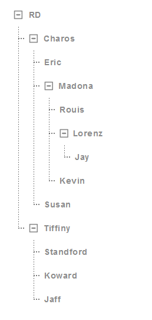

# Tree ?

## Tree

Properties      | Type                                              | Default value     | Description
----------------|:--------------------------------------------------|:------------------|:----------------------
collapsable     | `boolean` \| `undefined`                          | `false`           | Define tree is collapsable or not.
color           | "white" \| "black"                                | "white"           | Define the color of font.

## Node

Properties      | Type                                              | Default value     | Description
----------------|:--------------------------------------------------|:------------------|:----------------------
label           | `string` \| `React.ReactNode` \| `undefined`      | `undefined`       | Define the context showed in this node.
collapsable     | `boolean` \| `undefined`                          | `false`           | Define tree is collapsable or not.
icon            | `string` \| `undefined`                           | `undefined`       | Define postfix icon in the node.
defaultClose    | `boolean` \| `undefined`                          | `false`           | If `defaultClose` is `true`, the node will be closed after created.
className       | `string` \| `undefined`                           | `undefined`       | Programmer can use this property to defined specific CSS style.
style           | `React.CSSProperties` \| `undefined`              | `undefined`       | Programmer can use this property to defined inline CSS style.
onClick         | `((event: React.MouseEvent<HTMLDivElement, MouseEvent>) => void)` \| `undefined`              | `undefined`       | The callback function when element is clicked.



## Example

```javascript
// CYPD Tree sample code
import React from 'react';
import ReactDOM from 'react-dom';
import { Tree } from 'cypd';

class App extends React.Component {
    render() {
        return ( 
            <div>
                <Tree.Tree color='black' collapsable>
                    <Tree.Node label='RD'>
                        <Tree.Node label='Charos'>
                            <Tree.Node label='Eric'></Tree.Node>
                            <Tree.Node label='Madona'>
                                <Tree.Node label='Rouis'></Tree.Node>
                                <Tree.Node label='Lorenz'>
                                    <Tree.Node label='Jay'></Tree.Node>
                                </Tree.Node>
                                <Tree.Node label='Kevin'></Tree.Node>
                            </Tree.Node>
                            <Tree.Node label='Susan'></Tree.Node>
                        </Tree.Node>
                        <Tree.Node label='Tiffiny'>
                            <Tree.Node label='Standford'></Tree.Node>
                            <Tree.Node label='Koward'></Tree.Node>
                            <Tree.Node label='Jaff'></Tree.Node>
                        </Tree.Node>
                    </Tree.Node>
                </Tree.Tree>
            </div> 
        );
    }
}
ReactDOM.render(<App />, document.getElementById('root'));
```